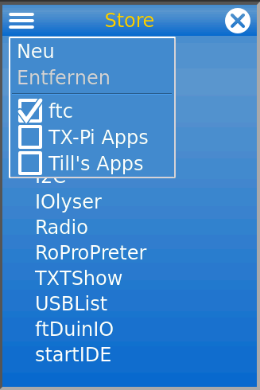

# TX-Pi apps
This repository provides applications which are specific for the
[TX-Pi](https://tx-pi.de/). Further, it is used as additional app shop.

This project is not a replacement for the [fischertechnik community 
firmware](https://cfw.ftcommunity.de/) shop, but an addition. 

Ideally, all apps should work under the TX-Pi and the fischertechnik
TX/TXT devices with the cfw. This project contains apps that do not make 
sense for TX/TXT or only work with the TX-Pi due to technical limitations 
of the fischertechnik hardware.

## Usage as shop

The shop is pre-installed for all TX-Pi that use the current Raspbian 
Buster. You can find the "TX-Pi Apps" shop in the Store app. Click on the
menu and then select "TX-Pi Apps".

If the shop is not available on your device, select the menu and then "New". 
There you enter "TX-Pi Apps" for "Name" and "ftCommunity" for "User". 
Enter "tx-pi-apps" as the repository.

 
